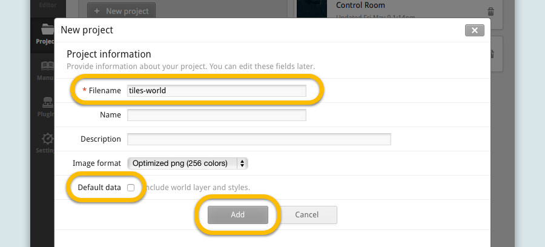
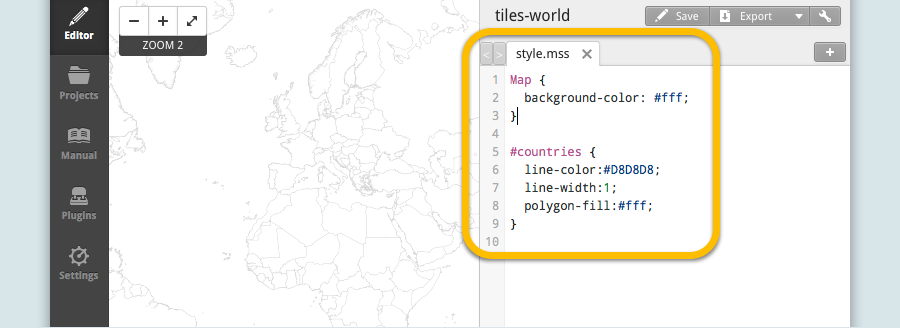
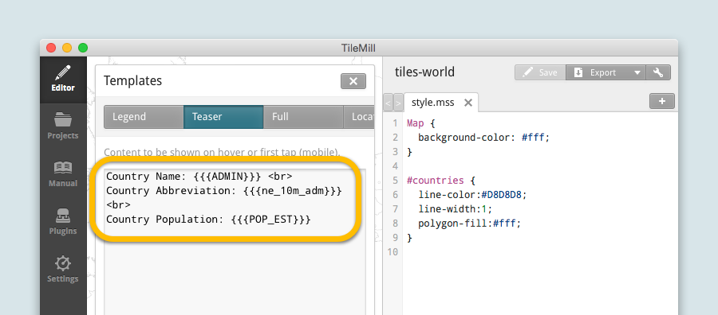
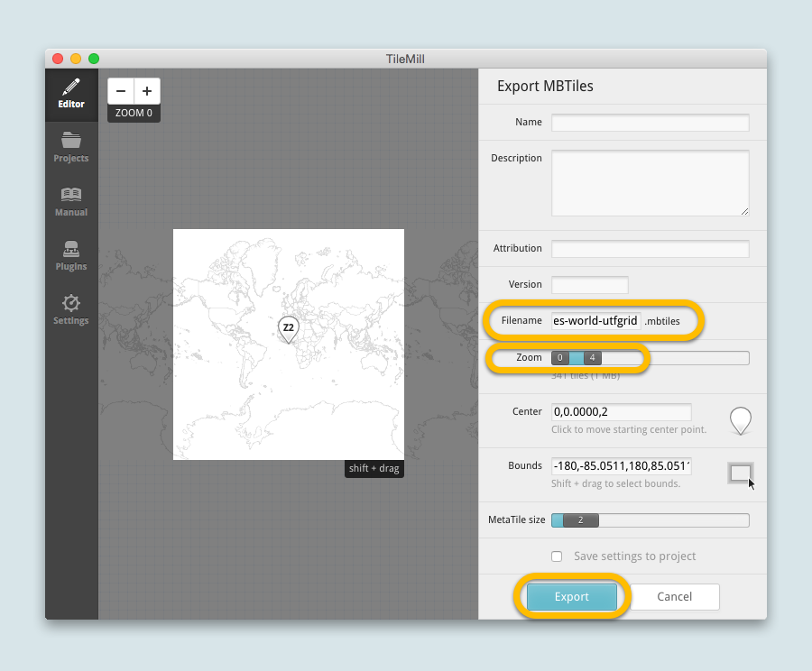

Getting Started with Tiles
==========================

<!-- START doctoc generated TOC please keep comment here to allow auto update -->
<!-- DON'T EDIT THIS SECTION, INSTEAD RE-RUN doctoc TO UPDATE -->


- [1A. Create Raster/Bitmap Tileset (in TileMill)](#1a-create-rasterbitmap-tileset-in-tilemill)
  - [Step 1: Get TileMill](#step-1-get-tilemill)
  - [Step 2: Create a new Project](#step-2-create-a-new-project)
  - [Step 3: Import Data](#step-3-import-data)
  - [Step 4: Style your Map](#step-4-style-your-map)
  - [(Optional Step 5: Add UTF-8 Grid)](#optional-step-5-add-utf-8-grid)
  - [Step 6: Export Map](#step-6-export-map)
- [1B. Create Vector Tiles (with GeoJSON & Tippecanoe)](#1b-create-vector-tiles-with-geojson--tippecanoe)
- [2. Run Tile Server](#2-run-tile-server)
  - [Option 1: Via Localhost](#option-1-via-localhost)
  - [Option 2: Via Heroku or DigitalOcean](#option-2-via-paas)
    - [Preparations:](#preparations)
    - [Easy Setup:](#easy-setup)
    - [Expert Setup:](#expert-setup)
      - [Step 1: Learn Git](#step-1-learn-git)
      - [Step 2: Create New Project](#step-2-create-new-project)
      - [Step 3: Set Up Repository](#step-3-set-up-repository)
    - [Check the Status](#check-the-status)
    - [Add tiles via SFTP](#add-tiles-via-sftp)
    - [Test the Tiles](#test-the-tiles)
- [3. Use The Tileset](#3-use-the-tileset)

<!-- END doctoc generated TOC please keep comment here to allow auto update -->


## 1A. Create Raster/Bitmap Tileset (in TileMill)

### Step 1: Get TileMill
Download and install [TileMill](https://www.mapbox.com/tilemill/) if you haven't done so already. If this is new to you: TileMill is an design studio by the amazing team at [Mapbox](mapbox.com) to create beautiful maps.

And If you haven't heard of Mapbox – check out their [website](mapbox.com) and [blog](https://www.mapbox.com/blog/).

Once everything is set up, we can start.

### Step 2: Create a new Project
Add a **new project**.


**Set a name** for your project and **untick the "Default data"-checkbox**, we are going to creating a map from scratch. Of course!


You should end up with something like the following:


### Step 3: Import Data

You can choose from a variety of formats (e.g. GeoJSON, ESRI Shapefile, etc), but in this tutorial we will use an ESRI Shapefile of the world country boundaries. A shapefile is a vector file (of either points, lines, or polygons) that has attributes and is georeferenced. 

** Hint:** [optimizing your shapefiles](https://www.mapbox.com/tilemill/docs/guides/optimizing-shapefiles/) can help increasing the performance or your data in tilemill.

Open the layer menu and **add a new layer**.


**Browse Datasource** and select the **"countries.shp"** file from the tutorial folder (or use your own data). Then press **"Save & Style"**.


Now you should see the world country boundaries:


### Step 4: Style your Map
Mapbox has a [great tutorial](https://www.mapbox.com/tilemill/docs/crashcourse/styling/) on how to style maps with tilemill.

We go miniml and set the style for the countries to grey thin lines with a white fill:

    Map {
      background-color: #fff;
    }

    #countries {
      line-color:#D8D8D8;
      line-width:1;
      polygon-fill:#fff;
    }
    


### (Optional Step 5: Add UTF-8 Grid)

**Note:** A UTF-8 grid adds the possibility to add interaction hover events to a map. Our example shows for instance for every country feature the name, abbreviation and population. If data size or storage is an issue, it is useful to know that adding the hover events will increase the size of your tileset. [This article](https://www.mapbox.com/blog/how-interactivity-works-utfgrid/) by Mapbox does a good job explaining the UTF-8 grid functionality.

**Enable Interactivity** for hover events.


**Add the [MustacheJS](https://github.com/janl/mustache.js) template**.
For our shapefile the data will look like below, but you can inspect the data of each layer in the layer menu (bottom left):

    Country Name: {{{ADMIN}}} <br>
    Country Abbreviation: {{{ne_10m_adm}}} <br>
    Country Population: {{{POP_EST}}}


If you now **hover over a country**. It will show the text you defined with the mustache template, filled with the data from the shapefile.


### Step 6: Export Map
Hit **"Export"** and select **"MBtiles"** as a file format.


Give your tileset a **Name** and set the **min - max zoom dimensions**. Here we choose a zoom level from 0 (all the way zoomed out) to something around 4, to keep the file size of our tileset small (but you quite likley want more zoom levels for future projects). Then hit **"Export"**.


This will take a while. Once it's done: **Save it** and ...


... **move the "MBtiles"** into the data folder of your Tilehut.js directory. This will look like following:


***

## 1B. Create Vector Tiles (with GeoJSON & Tippecanoe)

Let's take our `countries.geojson` file and turn it into a vector tile set. Lucky for us [Mapbox](mapbox.com) has built a great commandline tool called [tippecanoe](https://github.com/mapbox/tippecanoe). In order to install it on your machine, please follow the instructions [here](https://github.com/mapbox/tippecanoe#installation):

```
$ brew install tippecanoe
```

Once [tippecanoe](https://github.com/mapbox/tippecanoe) is installed, you can run the following on your `countries.geojson` file:

```
$ tippecanoe -o tiles-world-vector.mbtiles -z5 -pp countries.geojson 
```
What's happening here: 

* **tippecanoe**: this calls the tippecanoe function
* **-o tiles-world-vector**: says, "our output file will be called tiles-world-vector.mbtiles"
* **-z5**: tells tippecanoe to only produce tiles to a max of zoom level 5.
* **-pp**: means "no polygon splitting"
* **countries.geojson**: is the geojson file of our countries.

You can read about the other options for producing vector tiles [here](https://github.com/mapbox/tippecanoe#options).

**And that's it! Now we have beautiful vector tiles to work with. Now let's set up our server. Keep going!**

***

## 2. Run Tile Server
### Option 1: Via Localhost
Open the **Terminal**, **navigate to the Tilehut.js** folder and **run** `node server.js` to serve the files. As you can see, your server is now running at <http://localhost:8000/>.


You can inspect tilesets (even unknown ones) by opening them in your **browser**, e.g. <http://localhost:8000/tiles-world-simple/map/>. This works for normal raster tiles, as well as UTF-8 tiles and even vector tiles.


### Option 2: Via Heroku or DigitalOcean
We've tested a few services and have documented our methods as part of other tutorials. You're welcome to decide which service best fits your needs. So far we've tried/tested deployment to:

- [Heroku](https://www.heroku.com) // [See Part 3+ in this tutorial on Vector Tiles: Your own Tilehut](https://github.com/joeyklee/hello-vector-tiles#part-3-our-very-own-tilehut)
- [DigitalOcean](https://www.digitalocean.com/) // [See documentation from the EnergyExplorer.ca project](https://github.com/ubccalp/tileserver/blob/master/README-DigitalOcean-Setup.md)

<!-- If you're looking for a docker container for this task, you might also check out [tilehut-docker](https://hub.docker.com/r/joeyklee/tilehut-docker/). NOTE: Last update was a year ago and may not be up to date. -->

After deploying to your chosen platform, you can inspect your data via:

Now you can inspect your map ...

`{yourURL}.com/{tilesetname}/map`

... and the tiles are ready to use via

`{yourURL}.com/{tilesetname}/{z}/{x}/{y}.png` (for raster tiles) or `{yourURL}.com/{tilesetname}/{z}/{x}/{y}.pbf` (for vector tiles)

## 3. Use The Tileset
We included some example files into the repository which show you how to use [Leaflet JS](http://leafletjs.com/) or [Mapbox GL JS](https://www.mapbox.com/blog/mapbox-gl-js/) to display a map using your tileset.

**Check:** `tilehut/examples/` ([Github](https://github.com/b-g/tilehut/tree/master/examples))


